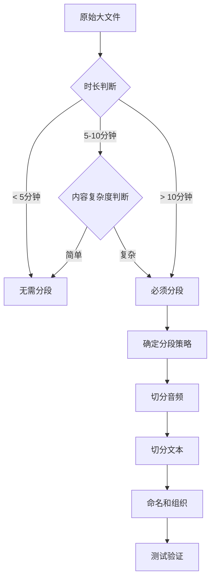

# 音频知识库大文件处理方案 - 详细设计文档

> 本文档用于指导 AI 编程助手处理音频知识库中的大文件问题，请结合 `audio-knowledge-base-mvp-design.md` 一起阅读。

## 一、问题背景

### 1.1 问题描述

在音频知识库 MVP 实现中，用户可能会上传较大的音频文件（如 10-30 分钟的讲解音频）。大文件会带来以下挑战：

| 问题 | 影响 | 严重程度 |
|------|------|----------|
| 内存占用 | 加载大文件可能导致 OOM（Out of Memory） | ⚠️⚠️⚠️ |
| 响应延迟 | 用户需要等待长时间才能开始播放 | ⚠️⚠️ |
| 检索精度 | 长文本分块后，检索匹配不精确 | ⚠️⚠️ |
| 用户体验 | 无法精确回答用户的具体问题 | ⚠️⚠️⚠️ |
| 设备限制 | ESP32 设备内存有限，无法缓存大音频 | ⚠️⚠️⚠️ |

### 1.2 问题示例

**场景**：用户有一个 30 分钟的产品介绍音频

```
原始文件:
product-intro.mp3 (30分钟, 30MB) + product-intro.txt (6000字)

问题:
1. 启动时加载 30MB 文件到内存
2. 6000字文本分成 12 个 chunk（每个 500 字）
3. 用户问"产品价格是多少"，检索到第 8 个 chunk
4. 但播放器需要播放整个 30 分钟音频，用户等待时间长
5. ESP32 设备可能无法处理这么大的音频流
```

## 二、解决方案概览

### 2.1 方案对比

| 方案 | 内存占用 | 检索精度 | 实现复杂度 | 用户体验 | MVP适用性 |
|------|---------|---------|-----------|---------|----------|
| 不分段 | 高 ❌ | 低 ❌ | 低 ✅ | 差 ❌ | 不推荐 |
| 手动分段 | 低 ✅ | 高 ✅ | 中 ⚠️ | 好 ✅ | 推荐 ⭐⭐⭐⭐⭐ |
| 自动分段 | 低 ✅ | 高 ✅ | 高 ❌ | 好 ✅ | 后续优化 |
| 流式播放+片段提取 | 中 ⚠️ | 中 ⚠️ | 高 ❌ | 中 ⚠️ | 后续优化 |

### 2.2 推荐方案：手动分段

**MVP 阶段采用手动分段方案**，原因：
- ✅ 实现简单，无需额外开发
- ✅ 效果可控，用户可精确控制分段粒度
- ✅ 检索精度高，每个片段对应明确的主题
- ✅ 设备兼容性好，小文件流式播放无压力
- ✅ 快速验证，能快速上线验证效果

## 三、详细设计方案

### 3.1 核心思路

**将大音频文件切分成小段，每段对应一个独立的文本片段**

```
原始大文件:
product-intro.mp3 (30分钟) + product-intro.txt (6000字)
                ↓ 手动分段
处理后的小文件:
product-intro-001.mp3 (3分钟) + product-intro-001.txt (600字)  → 向量化
product-intro-002.mp3 (3分钟) + product-intro-002.txt (600字)  → 向量化
product-intro-003.mp3 (3分钟) + product-intro-003.txt (600字)  → 向量化
...
product-intro-010.mp3 (3分钟) + product-intro-010.txt (600字)  → 向量化
```

### 3.2 分段原则

#### 3.2.1 时长建议

- **推荐时长**：2-5 分钟
- **最大时长**：不超过 10 分钟
- **最短时长**：不少于 1 分钟

#### 3.2.2 内容建议

- **按主题分段**：每个片段对应一个明确的主题
- **按问答分段**：每个片段回答一个具体问题
- **按章节分段**：按内容自然章节划分
- **语义完整**：保持语义完整性，不在句子中间切分

#### 3.2.3 文本建议

- **字数控制**：每段文本 300-800 字
- **内容完整**：文本内容应完整描述该片段的主题
- **关键词明确**：包含明确的检索关键词

### 3.3 文件组织结构

```
knowledge-base/
├── audio/                              # 音频文件目录
│   ├── intro.mp3                       # 小文件示例（无需分段）
│   ├── product-intro-001.mp3          # 分段后的小文件
│   ├── product-intro-002.mp3
│   ├── product-intro-003.mp3
│   ├── faq-price.mp3                   # 问答类示例（独立主题）
│   └── faq-features.mp3
└── text/                               # 文本文件目录（同名）
    ├── intro.txt                       # 对应小文件
    ├── product-intro-001.txt          # 对应分段文件
    ├── product-intro-002.txt
    ├── product-intro-003.txt
    ├── faq-price.txt                   # 对应问答文件
    └── faq-features.txt
```

### 3.4 文件命名规范

#### 3.4.1 基本规则

- 音频文件和文本文件**必须同名**（仅扩展名不同）
- 文件名使用**英文、数字、连字符**组成
- 文件名应**语义明确**，便于理解内容
- 分段文件使用**序号后缀**（-001, -002, ...）

#### 3.4.2 命名示例

```
✅ 好的命名:
product-intro-001.mp3       # 产品介绍第1段
product-intro-002.mp3       # 产品介绍第2段
faq-how-to-use.mp3          # 常见问题：如何使用
faq-pricing.mp3             # 常见问题：定价
company-history.mp3         # 公司历史（独立主题，无需分段）

❌ 不好的命名:
audio1.mp3                  # 语义不明确
第1段.mp3                    # 使用中文，可能编码问题
product.intro.001.mp3       # 使用点号，不规范
```

#### 3.4.3 编号规则

```
格式: <主题名称>-<序号>.<扩展名>

示例:
- intro-001.mp3, intro-002.mp3, intro-003.mp3
- faq-001.mp3, faq-002.mp3, faq-003.mp3
- product-overview-001.mp3, product-overview-002.mp3
```

## 四、实施步骤

### 4.1 步骤一：分析原始内容

**目标**：确定分段策略

**操作**：
1. 听一遍完整音频，理解内容结构
2. 阅读完整文本，标记关键主题
3. 确定分段点（主题切换、问答边界等）

**示例**：
```
原始音频: product-intro.mp3 (30分钟)
内容分析:
- 00:00-03:00 产品背景介绍
- 03:00-06:00 产品核心功能
- 06:00-09:00 产品技术架构
- 09:00-12:00 产品使用场景
- 12:00-15:00 产品定价方案
- 15:00-18:00 客户案例分享
- 18:00-21:00 常见问题解答
- 21:00-24:00 产品路线图
- 24:00-27:00 竞品对比
- 27:00-30:00 总结与展望

分段策略: 按3分钟一段，共10段
```

### 4.2 步骤二：切分音频文件

#### 方法 A：使用音频编辑软件（推荐）

**工具**：Audacity（免费、跨平台）

**操作步骤**：
1. 打开 Audacity
2. 导入原始音频文件
3. 选择第一段音频（0:00-3:00）
4. 导出选中部分为 `product-intro-001.mp3`
5. 重复步骤 3-4，导出其他分段

**优点**：
- ✅ 可视化操作，精确切分
- ✅ 支持淡入淡出效果
- ✅ 支持多种音频格式
- ✅ 免费开源

#### 方法 B：使用 FFmpeg 命令行

**安装**：
```bash
# macOS
brew install ffmpeg

# Ubuntu/Debian
sudo apt-get install ffmpeg

# Windows
# 从 https://ffmpeg.org/download.html 下载
```

**命令示例**：
```bash
# 按时长分段（每段3分钟）
ffmpeg -i product-intro.mp3 -f segment -segment_time 180 -c copy product-intro-%03d.mp3

# 按时间点分段
ffmpeg -i product-intro.mp3 -ss 00:00:00 -to 00:03:00 -c copy product-intro-001.mp3
ffmpeg -i product-intro.mp3 -ss 00:03:00 -to 00:06:00 -c copy product-intro-002.mp3
ffmpeg -i product-intro.mp3 -ss 00:06:00 -to 00:09:00 -c copy product-intro-003.mp3
```

**参数说明**：
- `-i`: 输入文件
- `-ss`: 开始时间
- `-to`: 结束时间
- `-c copy`: 直接复制，不重新编码（速度快）
- `-f segment`: 分段输出
- `-segment_time`: 每段时长（秒）

#### 方法 C：使用在线工具

**推荐工具**：
- mp3cut.net
- audio-splitter.com
- 123apps.com/audio-cutter

**优点**：
- ✅ 无需安装软件
- ✅ 操作简单

**缺点**：
- ❌ 需要上传文件
- ❌ 隐私风险
- ❌ 文件大小限制

### 4.3 步骤三：切分文本文件

#### 手动切分（推荐）

**原则**：
1. 文本内容与音频内容对应
2. 保持语义完整性
3. 包含明确的检索关键词

**示例**：

**原始文件**：`product-intro.txt` (6000字)
```
产品背景介绍...（600字）
产品核心功能...（600字）
产品技术架构...（600字）
...
```

**切分后**：

`product-intro-001.txt`:
```
产品背景介绍

我们的产品诞生于2020年，旨在解决企业数字化转型中的痛点问题。
经过三年的发展，我们已经服务了超过1000家企业客户...

主要背景：
- 市场需求分析
- 行业痛点梳理
- 产品定位说明
```

`product-intro-002.txt`:
```
产品核心功能

我们的产品提供了五大核心功能模块：

1. 智能语音识别
   支持10+种语言，准确率达98%

2. 自然语言理解
   基于最新的GPT模型，理解用户意图

3. 多轮对话管理
   上下文记忆，对话流畅自然

4. 知识库检索
   秒级响应，精准匹配

5. 数据分析报表
   可视化展示，决策支持
```

### 4.4 步骤四：文件命名和组织

**目录结构**：
```
knowledge-base/
├── audio/
│   ├── product-intro-001.mp3
│   ├── product-intro-002.mp3
│   ├── product-intro-003.mp3
│   └── ...
└── text/
    ├── product-intro-001.txt
    ├── product-intro-002.txt
    ├── product-intro-003.txt
    └── ...
```

**验证清单**：
- [ ] 音频文件和文本文件数量一致
- [ ] 文件名一一对应（除扩展名外）
- [ ] 文件名符合命名规范
- [ ] 文件大小合理（音频 < 10MB，文本 < 10KB）

### 4.5 步骤五：测试验证

#### 5.1 启动测试

```bash
# 启动应用
./bin/start.sh

# 查看日志
tail -f logs/xiaozhi-dialogue.log | grep "知识库"
```

**预期输出**：
```
2026-05-06 10:00:00 INFO  KnowledgeBaseLoader - 开始加载知识库...
2026-05-06 10:00:01 INFO  KnowledgeBaseLoader - 已加载: product-intro-001.txt (1 个片段)
2026-05-06 10:00:02 INFO  KnowledgeBaseLoader - 已加载: product-intro-002.txt (1 个片段)
2026-05-06 10:00:03 INFO  KnowledgeBaseLoader - 已加载: product-intro-003.txt (1 个片段)
2026-05-06 10:00:04 INFO  KnowledgeBaseLoader - 知识库向量化完成，共加载 10 个文档
```

#### 5.2 检索测试

**测试用例 1**：精确匹配
```
用户输入: "产品的核心功能有哪些？"
预期结果: 检索到 product-intro-002.mp3
实际音频: 播放 product-intro-002.mp3（产品核心功能介绍）
```

**测试用例 2**：模糊匹配
```
用户输入: "你们的产品能做什么？"
预期结果: 检索到 product-intro-002.mp3（最相关）
实际音频: 播放 product-intro-002.mp3
```

**测试用例 3**：多候选匹配
```
用户输入: "我想了解一下产品"
预期结果: 检索到 product-intro-001.mp3（背景介绍）
实际音频: 播放 product-intro-001.mp3
```

#### 5.3 播放测试

**测试要点**：
- [ ] 音频是否能正常播放
- [ ] 播放是否流畅，无卡顿
- [ ] 音频时长是否符合预期
- [ ] 播放完成后是否正常结束

## 五、最佳实践

### 5.1 内容分段建议

#### 按主题分段

```
✅ 推荐:
主题明确，用户可以根据问题快速定位

示例:
- company-history.mp3          # 公司历史（独立主题）
- product-features.mp3         # 产品功能（独立主题）
- faq-pricing.mp3              # 常见问题：定价（独立主题）

❌ 不推荐:
主题混杂，用户难以定位

示例:
- all-content.mp3              # 包含所有主题（太长）
- random-001.mp3               # 内容无明确主题
```

#### 按问答分段

```
✅ 推荐:
每个问答独立，检索精准

示例:
- faq-how-to-buy.mp3           # 如何购买？
- faq-how-to-use.mp3           # 如何使用？
- faq-technical-support.mp3    # 技术支持？
- faq-refund-policy.mp3        # 退款政策？

❌ 不推荐:
多个问答混合

示例:
- faq-collection.mp3           # 包含20个问答（太长）
```

#### 按章节分段

```
✅ 推荐:
按自然章节划分，符合阅读习惯

示例:
培训课程:
- training-chapter-01.mp3      # 第一章：基础知识
- training-chapter-02.mp3      # 第二章：进阶技巧
- training-chapter-03.mp3      # 第三章：实战案例

❌ 不推荐:
在句子中间切分

示例:
- training-001.mp3             # 在句子中间切分
- training-002.mp3             # 语义不完整
```

### 5.2 文本编写建议

#### 包含关键词

```
✅ 好的文本:
产品定价方案

我们提供三种定价方案：

1. 基础版：99元/月
   适合个人用户，包含基础功能

2. 专业版：299元/月
   适合中小企业，包含高级功能

3. 企业版：999元/月
   适合大型企业，包含全部功能和专属服务

关键词: 定价、价格、费用、套餐、购买

❌ 不好的文本:
关于价格的问题请咨询客服...
（缺少具体信息和关键词）
```

#### 语义完整

```
✅ 好的文本:
产品的核心优势

我们的产品具有三大核心优势：

第一，技术领先。采用最新的AI算法，识别准确率达98%。

第二，易于使用。零代码配置，5分钟即可上线。

第三，服务完善。7*24小时技术支持，2小时内响应。

总结：选择我们，就是选择专业、高效、可靠。

❌ 不好的文本:
产品的核心优势包括技术领先、易于使用、服务完善...
（缺少详细说明和总结）
```

#### 篇幅适中

```
✅ 推荐篇幅: 300-800字

太短（< 300字）:
产品很好用。（太简单，检索信息不足）

太长（> 800字）:
（用户难以快速理解，可能超出显示范围）

适中（300-800字）:
产品功能介绍 + 具体说明 + 使用场景 + 关键词
```

### 5.3 音频质量建议

#### 格式选择

```
✅ 推荐格式:
- MP3: 兼容性最好，压缩率高
- WAV: 无损音质，文件较大
- OGG: 开源格式，适合Web

❌ 不推荐格式:
- FLAC: 文件太大
- AIFF: 兼容性差
```

#### 音质要求

```
✅ 推荐:
- 采样率: 16kHz 以上
- 比特率: 128kbps 以上
- 声道: 单声道或立体声均可
- 音量: 适中，无爆音

❌ 不推荐:
- 采样率 < 8kHz（音质差）
- 比特率 < 64kbps（有杂音）
- 音量过小或过大
```

#### 背景处理

```
✅ 推荐:
- 去除背景噪音
- 去除静音片段
- 统一音量水平

工具:
- Audacity: 降噪、压缩、归一化
- Adobe Audition: 专业音频处理
```

## 六、常见问题

### Q1: 如何判断是否需要分段？

**A**: 按以下标准判断：

```
时长 < 5分钟 → 无需分段
时长 5-10分钟 → 根据内容复杂度决定
时长 > 10分钟 → 建议分段
时长 > 30分钟 → 必须分段
```

### Q2: 分段后发现检索不准确怎么办？

**A**: 可能原因和解决方案：

| 原因 | 解决方案 |
|------|---------|
| 文本关键词不明确 | 优化文本，添加更多关键词 |
| 分段粒度太粗 | 进一步细分，每段控制在 2-3 分钟 |
| 文本与音频不匹配 | 确保文本内容准确描述音频内容 |
| 检索阈值设置不当 | 调整 similarity-threshold 参数 |

### Q3: 分段后用户问的问题跨越多个片段怎么办？

**A**: 提供两种解决方案：

**方案A：返回最相关的片段**
```java
// 当前实现：返回 TopK=1 的结果
List<Document> results = vectorStore.similaritySearch(
    SearchRequest.query(query).withTopK(1)
);
```

**方案B：返回多个相关片段（后续优化）**
```java
// 优化实现：返回 TopK=3 的结果
List<Document> results = vectorStore.similaritySearch(
    SearchRequest.query(query).withTopK(3)
);

// 播放策略：
// 1. 先播放最相关的片段
// 2. 提示用户：还有其他相关内容
// 3. 用户确认后播放下一个片段
```

### Q4: 音频文件太大，内存不够怎么办？

**A**: 检查以下几点：

1. **确认已分段**：每个音频文件应 < 10MB
2. **检查代码**：确保使用流式读取，不是一次性加载
   ```java
   // ✅ 正确：流式读取
   List<byte[]> chunks = AudioUtils.readAsPcmChunks(audioPath);
   
   // ❌ 错误：一次性加载
   byte[] audioData = Files.readAllBytes(audioPath);
   ```
3. **调整JVM内存**：增加堆内存配置
   ```bash
   java -Xmx2g -jar app.jar
   ```

### Q5: 如何处理已有的大文件？

**A**: 处理流程：

```
1. 评估文件: 检查时长和内容
2. 确定策略: 按主题/问答/章节分段
3. 工具选择: Audacity 或 FFmpeg
4. 执行分段: 切分音频和文本
5. 命名组织: 按规范命名文件
6. 测试验证: 启动应用并测试检索
```

## 七、后续优化方向

### 7.1 自动分段工具（后续开发）

**目标**：自动将大文件分段，无需手动操作

**技术方案**：
```java
@Component
public class AudioAutoSplitter {
    
    /**
     * 自动分段音频文件
     * @param audioPath 音频文件路径
     * @param textPath 文本文件路径
     * @return 分段后的文件对列表
     */
    public List<AudioTextPair> autoSplit(Path audioPath, Path textPath, int chunkSize) {
        // 1. 检查文件大小，决定是否分段
        // 2. 读取文本并分块
        // 3. 使用 FFmpeg 按时间分段
        // 4. 文本与音频对齐
        // 5. 返回分段结果
    }
}
```

**配置项**：
```yaml
knowledge:
  base:
    auto-split: true              # 启用自动分段
    max-audio-size-mb: 10         # 超过此大小自动分段
    segment-duration-seconds: 60  # 每段时长
```

### 7.2 智能分段算法（后续优化）

**目标**：根据音频内容智能确定分段点

**技术方案**：
1. **语音识别分段**：使用 STT 识别音频内容，按语义分段
2. **静音检测分段**：检测静音片段作为分段点
3. **主题识别分段**：使用 NLP 识别主题切换点

### 7.3 多片段检索（后续优化）

**目标**：支持返回多个相关片段并合并播放

**技术方案**：
```java
public class KnowledgeSearchService {
    
    public Optional<List<AudioSegment>> searchMultiple(String query, int topK) {
        List<Document> results = vectorStore.similaritySearch(
            SearchRequest.query(query).withTopK(topK)
        );
        
        // 返回多个片段，按相似度排序
        // 播放器支持连续播放多个片段
    }
}
```

### 7.4 片段预览和跳转（后续优化）

**目标**：支持片段预览和用户跳转

**技术方案**：
1. 检索结果显示片段摘要
2. 用户可以选择播放哪个片段
3. 支持跳转到相关片段

## 八、工具和资源

### 8.1 音频编辑工具

| 工具 | 平台 | 价格 | 推荐度 |
|------|------|------|--------|
| Audacity | 跨平台 | 免费 | ⭐⭐⭐⭐⭐ |
| Adobe Audition | 跨平台 | 付费 | ⭐⭐⭐⭐ |
| GarageBand | macOS | 免费 | ⭐⭐⭐⭐ |
| Ocenaudio | 跨平台 | 免费 | ⭐⭐⭐ |

### 8.2 FFmpeg 常用命令

```bash
# 按时长分段
ffmpeg -i input.mp3 -f segment -segment_time 180 -c copy output%03d.mp3

# 按时间点分段
ffmpeg -i input.mp3 -ss 00:00:00 -to 00:03:00 -c copy output-001.mp3

# 查看音频信息
ffmpeg -i input.mp3

# 转换格式
ffmpeg -i input.wav -codec:a libmp3lame -qscale:a 2 output.mp3

# 调整音量
ffmpeg -i input.mp3 -af "volume=1.5" output.mp3

# 去除静音
ffmpeg -i input.mp3 -af "silenceremove=1:0:-50dB" output.mp3
```

### 8.3 文本处理工具

| 工具 | 用途 | 推荐度 |
|------|------|--------|
| VS Code | 文本编辑 | ⭐⭐⭐⭐⭐ |
| Notepad++ | 文本编辑 | ⭐⭐⭐⭐ |
| Sublime Text | 文本编辑 | ⭐⭐⭐⭐ |
| 在线文本分割器 | 快速分段 | ⭐⭐⭐ |

### 8.4 文件命名工具

```bash
# 批量重命名（macOS/Linux）
for i in {1..10}; do
  mv "old-name-$i.mp3" "new-name-$(printf %03d $i).mp3"
done

# 批量重命名（Windows PowerShell）
Get-ChildItem *.mp3 | ForEach-Object -Begin {$i=1} -Process {
  Rename-Item $_ -NewName "new-name-{0:000}.mp3" -f $i++
}
```

## 九、检查清单

### 9.1 分段前检查

- [ ] 已分析原始音频内容结构
- [ ] 已确定分段策略（主题/问答/章节）
- [ ] 已准备音频编辑工具
- [ ] 已阅读命名规范

### 9.2 分段中检查

- [ ] 音频切分点选择合理（不在句子中间）
- [ ] 音频质量良好（无噪音、无静音）
- [ ] 文本内容与音频匹配
- [ ] 文本包含明确关键词
- [ ] 文本语义完整

### 9.3 分段后检查

- [ ] 文件命名符合规范
- [ ] 音频和文本文件一一对应
- [ ] 文件大小合理（音频 < 10MB）
- [ ] 目录结构正确

### 9.4 测试检查

- [ ] 应用启动正常，无报错
- [ ] 知识库加载成功，日志正常
- [ ] 检索功能正常，能命中正确片段
- [ ] 音频播放流畅，无卡顿
- [ ] 降级逻辑正常，未命中时调用LLM

## 十、示例案例

### 案例 1：产品介绍音频

**原始文件**：
```
product-demo.mp3 (15分钟, 18MB)
product-demo.txt (3000字)
```

**分段方案**：
```
按主题分段，每段 2-3 分钟

product-demo-001.mp3 + product-demo-001.txt (产品背景)
product-demo-002.mp3 + product-demo-002.txt (核心功能)
product-demo-003.mp3 + product-demo-003.txt (技术架构)
product-demo-004.mp3 + product-demo-004.txt (使用场景)
product-demo-005.mp3 + product-demo-005.txt (客户案例)
```

**检索效果**：
```
用户问: "产品有什么功能？"
命中: product-demo-002.mp3
播放: 核心功能介绍（2分30秒）

用户问: "有哪些客户案例？"
命中: product-demo-005.mp3
播放: 客户案例分享（3分15秒）
```

### 案例 2：培训课程音频

**原始文件**：
```
training-course.mp3 (45分钟, 50MB)
training-course.txt (9000字)
```

**分段方案**：
```
按章节分段，每章 5-8 分钟

training-chapter-001.mp3 + training-chapter-001.txt (第一章：基础)
training-chapter-002.mp3 + training-chapter-002.txt (第二章：进阶)
training-chapter-003.mp3 + training-chapter-003.txt (第三章：高级)
training-chapter-004.mp3 + training-chapter-004.txt (第四章：实战)
training-chapter-005.mp3 + training-chapter-005.txt (第五章：总结)
...
training-chapter-010.mp3 + training-chapter-010.txt (第十章：答疑)
```

**检索效果**：
```
用户问: "如何开始使用？"
命中: training-chapter-001.mp3
播放: 基础知识讲解（6分20秒）

用户问: "有实战案例吗？"
命中: training-chapter-004.mp3
播放: 实战案例演示（7分45秒）
```

### 案例 3：常见问题音频

**原始文件**：
```
faq-collection.mp3 (20分钟, 25MB)
faq-collection.txt (4000字，包含20个问答)
```

**分段方案**：
```
按问答分段，每个问答独立

faq-how-to-buy.mp3 + faq-how-to-buy.txt (如何购买？)
faq-how-to-use.mp3 + faq-how-to-use.txt (如何使用？)
faq-pricing.mp3 + faq-pricing.txt (价格是多少？)
faq-refund.mp3 + faq-refund.txt (如何退款？)
...
faq-technical-support.mp3 + faq-technical-support.txt (技术支持？)
```

**检索效果**：
```
用户问: "怎么买？"
命中: faq-how-to-buy.mp3
播放: 购买流程说明（1分15秒）

用户问: "价格贵不贵？"
命中: faq-pricing.mp3
播放: 定价方案介绍（2分30秒）
```

---

## 附录：快速参考

### A. 分段流程图



### B. 文件命名速查表

| 文件类型 | 命名格式 | 示例 |
|---------|---------|------|
| 单一主题 | `<主题>.mp3` | `intro.mp3` |
| 分段文件 | `<主题>-<序号>.mp3` | `intro-001.mp3` |
| 问答文件 | `faq-<关键词>.mp3` | `faq-pricing.mp3` |
| 章节文件 | `<主题>-chapter-<序号>.mp3` | `training-chapter-001.mp3` |

### C. FFmpeg 速查表

| 功能 | 命令 |
|------|------|
| 按时长分段 | `ffmpeg -i input.mp3 -f segment -segment_time 180 -c copy output%03d.mp3` |
| 按时间点分段 | `ffmpeg -i input.mp3 -ss 00:00:00 -to 00:03:00 -c copy output-001.mp3` |
| 查看信息 | `ffmpeg -i input.mp3` |
| 转换格式 | `ffmpeg -i input.wav output.mp3` |

---

**文档版本**：v1.0  
**最后更新**：2026-05-06  
**适用项目**：xiaozhi-esp32-server-java-5.0  
**相关文档**：audio-knowledge-base-mvp-design.md

---

## 使用说明

本文档是 `audio-knowledge-base-mvp-design.md` 的补充文档，专门解决大音频文件的处理问题。

**使用流程**：
1. 先阅读 `audio-knowledge-base-mvp-design.md` 了解整体方案
2. 如果有大文件需要处理，参考本文档的分段方案
3. 按照本文档的步骤执行手动分段
4. 完成后使用主文档进行集成测试

**AI 编程助手使用**：
- 如果用户询问大文件处理方案，引导其参考本文档
- 如果需要实现自动分段功能，参考"后续优化方向"章节
- 提供分段工具和技术支持建议