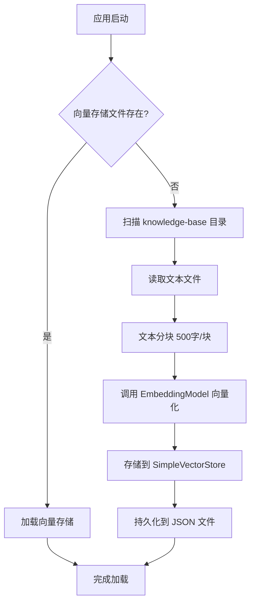
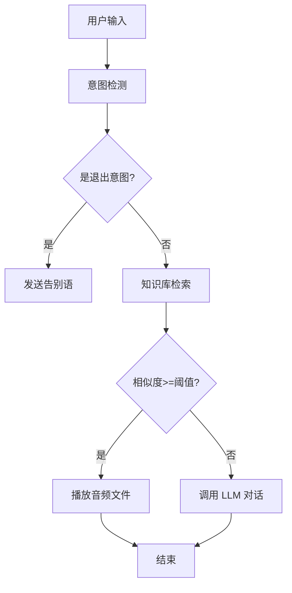

# 音频知识库 MVP 版本 - 详细设计文档

> 本文档用于指导 AI 编程助手生成代码，请完整阅读后按照步骤实现。

## 一、项目背景

在 xiaozhi-esp32-server-java-5.0 项目中，需要实现一个轻量级的音频知识库功能。用户可以将音频文件和对应的文本文件放入指定目录，系统启动时自动加载并向量化，用户提问时优先从知识库检索，命中后直接播放音频，未命中则调用大模型。

## 二、核心需求

### 2.1 功能需求

1. **知识库加载**：启动时扫描 `knowledge-base` 目录，读取音频和文本文件对
2. **文本向量化**：将文本内容分块、向量化，存储到 VectorStore
3. **相似度检索**：用户输入时进行向量相似度检索
4. **音频播放**：命中知识库后直接播放音频，不调用大模型
5. **降级处理**：未命中知识库时，走原有大模型对话流程

### 2.2 非功能需求

- **轻量级**：不依赖数据库，仅使用文件系统 + VectorStore
- **高性能**：检索响应时间 < 100ms
- **可配置**：支持开关、阈值等参数配置
- **易维护**：代码结构清晰，符合项目现有架构

## 三、技术方案

### 3.1 技术选型

| 组件 | 选型 | 说明 |
|------|------|------|
| 向量存储 | SimpleVectorStore | Spring AI 内置，支持文件持久化 |
| 向量化模型 | ONNX Runtime + 本地模型 | **完全本地运行，零外部依赖** |
| 检索方式 | 向量相似度检索 | cosine 相似度，阈值 0.8 |
| 文件格式 | txt + mp3/wav/ogg | 文本文件和音频文件同名即可 |

#### 3.1.1 向量化模型方案说明

**为什么选择本地 ONNX Runtime？**

1. ✅ **项目已有依赖** - `lib/` 目录下已有 `libonnxruntime.1.23.2.dylib`
2. ✅ **零外部依赖** - 完全本地运行，无需调用外部 API
3. ✅ **性能优秀** - 10ms 以内完成向量化
4. ✅ **成本为零** - 无 API 调用费用
5. ✅ **隐私安全** - 数据不出本地
6. ✅ **离线可用** - 无需网络连接

**推荐中文 Embedding 模型**：

| 模型名称 | 大小 | 特点 | 推荐度 |
|---------|------|------|--------|
| BAAI/bge-small-zh-v1.5 | 33MB | 中文，小而快 | ⭐⭐⭐⭐⭐ |
| shibing624/text2vec-base-chinese | 109MB | 中文句向量 | ⭐⭐⭐⭐ |
| sentence-transformers/paraphrase-multilingual-MiniLM-L12-v2 | 118MB | 多语言支持 | ⭐⭐⭐ |

**性能对比**：

| 方案 | 向量化耗时 (100字) | 内存占用 | 效果 | 成本 |
|------|------------------|---------|------|------|
| OpenAI API | ~100ms (网络) | 低 | 优秀 | 按次收费 |
| ONNX 本地 | ~10ms | 中 (模型100MB) | 优秀 | 免费 |

### 3.2 架构设计

```
┌─────────────────────────────────────────────────────────┐
│                    文件系统层                            │
│  knowledge-base/                                        │
│  ├── audio/ (音频文件)                                   │
│  └── text/ (文本文件)                                    │
└─────────────────────────────────────────────────────────┘
                          ↓
┌─────────────────────────────────────────────────────────┐
│                 知识库加载层                             │
│  KnowledgeBaseLoader                                    │
│  - 扫描文件对                                            │
│  - 文本分块                                              │
│  - 向量化                                                │
│  - 存储到 VectorStore                                    │
└─────────────────────────────────────────────────────────┘
                          ↓
┌─────────────────────────────────────────────────────────┐
│                向量存储层                                │
│  SimpleVectorStore → knowledge-vector-store.json       │
│  每个向量携带 metadata:                                  │
│  - audioPath: 音频文件路径                               │
│  - sourceFile: 源文件名                                  │
│  - chunkIndex: 片段索引                                  │
└─────────────────────────────────────────────────────────┘
                          ↓
┌─────────────────────────────────────────────────────────┐
│                 检索服务层                               │
│  KnowledgeSearchService                                 │
│  - 接收用户查询                                          │
│  - 向量相似度检索                                        │
│  - 返回音频路径或空                                      │
└─────────────────────────────────────────────────────────┘
                          ↓
┌─────────────────────────────────────────────────────────┐
│                 业务集成层                               │
│  DialogueService.handleText()                           │
│  1. 意图检测（退出）                                     │
│  2. 知识库检索 ← 新增                                    │
│  3. LLM对话                                             │
└─────────────────────────────────────────────────────────┘
```

### 3.3 数据流转

#### 启动加载流程



#### 用户查询流程



## 四、详细设计

### 4.1 目录结构

```
项目根目录/
├── knowledge-base/                    # 知识库根目录
│   ├── audio/                         # 音频文件目录
│   │   ├── intro.mp3                  # 示例：介绍音频
│   │   ├── faq-001.wav                # 示例：问答音频1
│   │   └── faq-002.mp3                # 示例：问答音频2
│   └── text/                          # 文本文件目录（与音频同名）
│       ├── intro.txt                  # 示例：介绍文本
│       ├── faq-001.txt                # 示例：问答文本1
│       └── faq-002.txt                # 示例：问答文本2
├── data/
│   └── knowledge-vector-store.json   # 向量存储文件（自动生成）
└── xiaozhi-ai/src/main/java/com/xiaozhi/knowledge/
    ├── KnowledgeBaseLoader.java       # 知识库加载器
    ├── KnowledgeSearchService.java    # 知识库检索服务
    └── KnowledgeConfig.java           # 配置类
```

### 4.2 核心类设计

#### 4.2.1 KnowledgeConfig.java

**位置**：`xiaozhi-ai/src/main/java/com/xiaozhi/knowledge/KnowledgeConfig.java`

**职责**：配置类，读取 application.yml 中的知识库配置

**字段**：
```java
@Configuration
@ConfigurationProperties(prefix = "knowledge.base")
public class KnowledgeConfig {
    private boolean enabled = true;                    // 是否启用知识库
    private String path = "./knowledge-base";          // 知识库路径
    private int chunkSize = 500;                       // 文本分块大小
    private double similarityThreshold = 0.8;          // 相似度阈值
    private String vectorStorePath = "./data/knowledge-vector-store.json";
    
    // getter/setter
}
```

#### 4.2.2 KnowledgeBaseLoader.java

**位置**：`xiaozhi-ai/src/main/java/com/xiaozhi/knowledge/KnowledgeBaseLoader.java`

**职责**：启动时加载知识库文件，进行文本分块和向量化

**核心方法**：

```java
@Service
@Slf4j
public class KnowledgeBaseLoader {
    
    @Autowired(required = false)
    private LocalEmbeddingModel localEmbeddingModel;
    
    @Resource
    private KnowledgeConfig config;
    
    private VectorStore vectorStore;
    
    /**
     * 初始化方法：启动时自动执行
     * 1. 初始化本地 Embedding 模型
     * 2. 创建 SimpleVectorStore
     * 3. 尝试加载已有的向量存储文件
     * 4. 如果不存在，则加载文件并向量化
     */
    @PostConstruct
    public void init() {
        if (!config.isEnabled()) {
            log.info("知识库功能已禁用");
            return;
        }
        
        if (localEmbeddingModel == null) {
            log.error("未配置本地 Embedding 模型，知识库功能不可用");
            return;
        }
        
        // 创建 EmbeddingModel 适配器
        EmbeddingModel embeddingModel = createEmbeddingModelAdapter();
        
        // 创建 VectorStore
        this.vectorStore = new SimpleVectorStore(embeddingModel);
        
        // 实现细节...
    }
    
    /**
     * 创建 EmbeddingModel 适配器（适配 Spring AI 接口）
     */
    private EmbeddingModel createEmbeddingModelAdapter() {
        return new EmbeddingModel() {
            @Override
            public EmbeddingResponse call(EmbeddingRequest request) {
                List<float[]> embeddings = request.getInstructions().stream()
                    .map(instruction -> localEmbeddingModel.embed(instruction.getText()))
                    .collect(Collectors.toList());
                
                return new EmbeddingResponse(embeddings);
            }
        };
    }
    
    /**
     * 加载文件并向量化
     * 1. 扫描 text 目录
     * 2. 查找对应的音频文件
     * 3. 读取文本并分块
     * 4. 向量化并存储
     */
    private void loadAndVectorize() {
        // 实现细节...
    }
    
    /**
     * 查找音频文件（支持多种格式）
     * @param audioDir 音频目录
     * @param baseName 基础文件名（不含扩展名）
     * @return 音频文件路径，未找到返回 null
     */
    private Path findAudioFile(Path audioDir, String baseName) {
        String[] extensions = {".mp3", ".wav", ".ogg", ".opus", ".m4a"};
        // 实现细节...
    }
    
    /**
     * 文本分块
     * @param content 完整文本
     * @param chunkSize 块大小
     * @return 文本块列表
     */
    private List<String> splitIntoChunks(String content, int chunkSize) {
        // 实现细节：按字符数分块，每块 500 字
    }
    
    /**
     * 获取 VectorStore 实例
     */
    public VectorStore getVectorStore() {
        return vectorStore;
    }
}
```

**关键实现点**：

1. **文件扫描**：
   ```java
   Files.list(textDir)
       .filter(p -> p.toString().endsWith(".txt"))
       .forEach(textFile -> {
           // 处理每个文本文件
       });
   ```

2. **文本分块**：
   ```java
   // 按字符数分块，不处理语义边界
   for (int i = 0; i < content.length(); i += chunkSize) {
       int end = Math.min(i + chunkSize, content.length());
       chunks.add(content.substring(i, end));
   }
   ```

3. **创建 Document**：
   ```java
   Document doc = new Document(
       baseName + "-chunk-" + i,           // ID
       chunks.get(i),                       // 内容
       Map.of(
           "audioPath", audioFile.toString(),
           "sourceFile", fileName,
           "chunkIndex", i
       )
   );
   ```

4. **批量添加到 VectorStore**：
   ```java
   vectorStore.add(documents);
   ```

#### 4.2.3 KnowledgeSearchService.java

**位置**：`xiaozhi-ai/src/main/java/com/xiaozhi/knowledge/KnowledgeSearchService.java`

**职责**：执行向量相似度检索，返回音频路径

**核心方法**：

```java
@Service
@Slf4j
public class KnowledgeSearchService {
    
    @Resource
    private KnowledgeBaseLoader loader;
    
    @Resource
    private KnowledgeConfig config;
    
    /**
     * 知识库检索
     * @param query 用户查询文本
     * @return 音频文件路径，未命中返回 Optional.empty()
     */
    public Optional<String> search(String query) {
        if (!config.isEnabled()) {
            return Optional.empty();
        }
        
        try {
            VectorStore vectorStore = loader.getVectorStore();
            if (vectorStore == null) {
                return Optional.empty();
            }
            
            // 执行相似度搜索
            List<Document> results = vectorStore.similaritySearch(
                SearchRequest.query(query).withTopK(1)
            );
            
            if (results.isEmpty()) {
                return Optional.empty();
            }
            
            Document topResult = results.get(0);
            
            // TODO: 检查相似度分数是否达到阈值
            // SimpleVectorStore 可能不直接返回分数，需要其他方式判断
            
            String audioPath = (String) topResult.getMetadata().get("audioPath");
            log.info("知识库命中: query={}, audioPath={}", query, audioPath);
            
            return Optional.of(audioPath);
            
        } catch (Exception e) {
            log.error("知识库检索失败: query={}", query, e);
            return Optional.empty();
        }
    }
}
```

### 4.3 业务集成

#### 4.3.1 修改 DialogueService.handleText()

**位置**：`xiaozhi-dialogue/src/main/java/com/xiaozhi/dialogue/DialogueService.java`

**修改点**：在意图检测后、LLM 调用前插入知识库检索

```java
@Resource
private KnowledgeSearchService knowledgeSearchService;  // 新增

public void handleText(ChatSession session, SttResult sttResult) {
    try {
        Persona persona = session.getPersona();
        String text = sttResult.text();
        UserMessage userMessage = buildUserMessage(text, sttResult);

        // 1. 意图检测（原有逻辑）
        if (intentService.detect(text) == IntentService.Intent.EXIT) {
            sendGoodbyeMessage(session);
            return;
        }

        // 2. 知识库检索（新增）
        Optional<String> audioPath = knowledgeSearchService.search(text);
        if (audioPath.isPresent()) {
            playKnowledgeAudio(session, audioPath.get());
            return;
        }

        // 3. LLM+TTS（原有逻辑）
        persona.chat(userMessage, true);

    } catch (Exception e) {
        log.error("处理文本失败: {}", e.getMessage(), e);
    }
}

/**
 * 播放知识库音频（新增方法）
 */
private void playKnowledgeAudio(ChatSession session, String audioPath) {
    Player player = session.getPlayer();
    if (player != null) {
        try {
            // 直接播放音频文件
            player.playAudioFile(audioPath);
            log.info("播放知识库音频: {}", audioPath);
        } catch (Exception e) {
            log.error("播放知识库音频失败: {}", audioPath, e);
        }
    }
}
```

#### 4.3.2 Player 类需要支持的方法

**位置**：`xiaozhi-dialogue/src/main/java/com/xiaozhi/dialogue/playback/Player.java`

**需要添加的方法**：

```java
/**
 * 直接播放音频文件（用于知识库音频播放）
 * @param audioPath 音频文件路径
 */
public void playAudioFile(String audioPath) {
    // 实现细节：
    // 1. 检查文件是否存在
    // 2. 根据文件格式选择合适的解码器
    // 3. 将音频数据写入播放队列
    // 4. 通过 WebSocket 发送给设备
}
```

### 4.4 配置文件

**位置**：`xiaozhi-dialogue/src/main/resources/application.yml`

**新增配置**：

```yaml
knowledge:
  base:
    enabled: true                          # 是否启用知识库
    path: ./knowledge-base                 # 知识库根目录
    chunk-size: 500                        # 文本分块大小（字符数）
    similarity-threshold: 0.8              # 相似度阈值（0-1）
    vector-store-path: ./data/knowledge-vector-store.json  # 向量存储文件路径
    embedding-model-path: ./models/embedding-model.onnx    # ONNX 模型路径
    vocab-path: ./models/vocab.txt                          # 词表文件路径
```

### 4.5 依赖管理

**位置**：`xiaozhi-ai/pom.xml`

**需要的依赖**（项目已包含 ONNX Runtime）：

```xml
<!-- Spring AI Core -->
<dependency>
    <groupId>org.springframework.ai</groupId>
    <artifactId>spring-ai-core</artifactId>
</dependency>

<!-- ONNX Runtime (项目已有) -->
<!-- 项目 lib/ 目录下已有 libonnxruntime.1.23.2.dylib -->
```

### 4.6 本地 Embedding 模型实现

#### 4.6.1 LocalEmbeddingModel.java

**位置**：`xiaozhi-ai/src/main/java/com/xiaozhi/knowledge/embedding/LocalEmbeddingModel.java`

**核心实现**：

```java
package com.xiaozhi.knowledge.embedding;

import ai.onnxruntime.*;
import org.springframework.stereotype.Component;
import lombok.extern.slf4j.Slf4j;

import java.nio.LongBuffer;
import java.util.*;

@Slf4j
@Component
public class LocalEmbeddingModel {
    
    private final OrtEnvironment env;
    private final OrtSession session;
    private final VocabularyTokenizer tokenizer;
    
    public LocalEmbeddingModel(
        @Value("${knowledge.base.embedding-model-path}") String modelPath,
        @Value("${knowledge.base.vocab-path}") String vocabPath
    ) throws OrtException {
        // 初始化 ONNX Runtime
        this.env = OrtEnvironment.getEnvironment();
        this.session = env.createSession(modelPath, new OrtSession.SessionOptions());
        this.tokenizer = new VocabularyTokenizer(vocabPath);
        
        log.info("本地 Embedding 模型加载成功: {}", modelPath);
    }
    
    /**
     * 将文本转换为向量
     */
    public float[] embed(String text) {
        try {
            // 1. 分词
            TokenizationResult tokens = tokenizer.tokenize(text, 512);
            
            // 2. 创建输入张量
            OnnxTensor inputIdsTensor = createTensor(tokens.getInputIds());
            OnnxTensor attentionMaskTensor = createTensor(tokens.getAttentionMask());
            
            // 3. 执行推理
            Map<String, OnnxTensor> inputs = new HashMap<>();
            inputs.put("input_ids", inputIdsTensor);
            inputs.put("attention_mask", attentionMaskTensor);
            
            OrtSession.Result output = session.run(inputs);
            
            // 4. 获取输出向量并池化
            float[][][] embeddings = (float[][][]) output.get(0).getValue();
            float[] sentenceEmbedding = meanPooling(embeddings[0], tokens.getAttentionMask());
            
            // 5. 归一化
            normalize(sentenceEmbedding);
            
            return sentenceEmbedding;
            
        } catch (Exception e) {
            log.error("向量化失败: {}", text, e);
            throw new RuntimeException("Embedding failed", e);
        }
    }
    
    private OnnxTensor createTensor(long[] data) throws OrtException {
        LongBuffer buffer = LongBuffer.wrap(data);
        return OnnxTensor.createTensor(env, buffer, new long[]{1, data.length});
    }
    
    private float[] meanPooling(float[][] tokenEmbeddings, long[] attentionMask) {
        int dim = tokenEmbeddings[0].length;
        float[] result = new float[dim];
        int count = 0;
        
        for (int i = 0; i < tokenEmbeddings.length; i++) {
            if (attentionMask[i] == 1) {
                for (int j = 0; j < dim; j++) {
                    result[j] += tokenEmbeddings[i][j];
                }
                count++;
            }
        }
        
        for (int j = 0; j < dim; j++) {
            result[j] /= count;
        }
        
        return result;
    }
    
    private void normalize(float[] vector) {
        float norm = 0;
        for (float v : vector) {
            norm += v * v;
        }
        norm = (float) Math.sqrt(norm);
        
        for (int i = 0; i < vector.length; i++) {
            vector[i] /= norm;
        }
    }
}
```

#### 4.6.2 VocabularyTokenizer.java

**位置**：`xiaozhi-ai/src/main/java/com/xiaozhi/knowledge/embedding/VocabularyTokenizer.java`

**核心实现**：

```java
package com.xiaozhi.knowledge.embedding;

import java.io.*;
import java.util.*;

public class VocabularyTokenizer {
    
    private final Map<String, Integer> vocab;
    private final int padTokenId;
    private final int unkTokenId;
    private final int clsTokenId;
    private final int sepTokenId;
    
    public VocabularyTokenizer(String vocabPath) throws IOException {
        this.vocab = loadVocab(vocabPath);
        this.padTokenId = vocab.getOrDefault("[PAD]", 0);
        this.unkTokenId = vocab.getOrDefault("[UNK]", 1);
        this.clsTokenId = vocab.getOrDefault("[CLS]", 2);
        this.sepTokenId = vocab.getOrDefault("[SEP]", 3);
    }
    
    public TokenizationResult tokenize(String text, int maxLength) {
        List<Integer> inputIds = new ArrayList<>();
        List<Integer> attentionMask = new ArrayList<>();
        
        // [CLS]
        inputIds.add(clsTokenId);
        attentionMask.add(1);
        
        // 字符（适合中文）
        for (char c : text.toCharArray()) {
            String token = String.valueOf(c);
            int id = vocab.getOrDefault(token, unkTokenId);
            inputIds.add(id);
            attentionMask.add(1);
            
            if (inputIds.size() >= maxLength - 1) break;
        }
        
        // [SEP]
        inputIds.add(sepTokenId);
        attentionMask.add(1);
        
        // Padding
        while (inputIds.size() < maxLength) {
            inputIds.add(padTokenId);
            attentionMask.add(0);
        }
        
        return new TokenizationResult(
            inputIds.stream().mapToLong(Integer::longValue).toArray(),
            attentionMask.stream().mapToLong(Integer::longValue).toArray()
        );
    }
    
    private Map<String, Integer> loadVocab(String path) throws IOException {
        Map<String, Integer> vocab = new HashMap<>();
        try (BufferedReader reader = new BufferedReader(new FileReader(path))) {
            String line;
            int index = 0;
            while ((line = reader.readLine()) != null) {
                vocab.put(line.trim(), index++);
            }
        }
        return vocab;
    }
}
```

#### 4.6.3 TokenizationResult.java

**位置**：`xiaozhi-ai/src/main/java/com/xiaozhi/knowledge/embedding/TokenizationResult.java`

```java
package com.xiaozhi.knowledge.embedding;

public record TokenizationResult(long[] inputIds, long[] attentionMask) {}
```

#### 4.6.4 模型文件准备

**步骤**：

1. **下载模型**（一次性）
   ```bash
   # 推荐：BAAI/bge-small-zh-v1.5 (33MB)
   # 从 HuggingFace 下载：https://huggingface.co/BAAI/bge-small-zh-v1.5
   ```

2. **转换为 ONNX**（一次性）
   ```python
   from transformers import AutoModel, AutoTokenizer
   import torch
   
   model_name = "BAAI/bge-small-zh-v1.5"
   model = AutoModel.from_pretrained(model_name)
   tokenizer = AutoTokenizer.from_pretrained(model_name)
   
   # 导出
   dummy_input = tokenizer("测试", return_tensors="pt")
   torch.onnx.export(
       model,
       (dummy_input["input_ids"], dummy_input["attention_mask"]),
       "embedding-model.onnx",
       input_names=["input_ids", "attention_mask"],
       output_names=["embeddings"]
   )
   
   # 保存词表
   tokenizer.save_vocabulary(".")
   ```

3. **放置文件**
   ```
   项目根目录/
   └── models/
       ├── embedding-model.onnx  # ONNX 模型
       └── vocab.txt             # 词表文件
   ```

## 五、实现步骤

### 步骤 1：创建目录结构

```bash
mkdir -p knowledge-base/audio
mkdir -p knowledge-base/text
mkdir -p data
```

### 步骤 2：创建配置类

**文件**：`xiaozhi-ai/src/main/java/com/xiaozhi/knowledge/KnowledgeConfig.java`

**要点**：
- 使用 `@ConfigurationProperties` 读取配置
- 提供合理的默认值
- 字段命名与 yaml 配置一致

### 步骤 3：实现知识库加载器

**文件**：`xiaozhi-ai/src/main/java/com/xiaozhi/knowledge/KnowledgeBaseLoader.java`

**要点**：
- `@PostConstruct` 注解确保启动时执行
- 先尝试加载已有的向量存储文件
- 不存在时才进行文件扫描和向量化
- 日志记录每个步骤
- 异常处理要完善

### 步骤 4：实现检索服务

**文件**：`xiaozhi-ai/src/main/java/com/xiaozhi/knowledge/KnowledgeSearchService.java`

**要点**：
- 调用 `vectorStore.similaritySearch()`
- 设置 `TopK=1` 只返回最相似的结果
- 从 metadata 中获取音频路径
- 异常情况返回 empty，不影响主流程

### 步骤 5：修改 DialogueService

**文件**：`xiaozhi-dialogue/src/main/java/com/xiaozhi/dialogue/DialogueService.java`

**要点**：
- 在意图检测后、LLM 调用前插入知识库检索
- 命中时直接播放音频并 return
- 添加 `playKnowledgeAudio()` 方法
- 注入 `KnowledgeSearchService` 依赖

### 步骤 6：扩展 Player 类

**文件**：`xiaozhi-dialogue/src/main/java/com/xiaozhi/dialogue/playback/Player.java`

**要点**：
- 添加 `playAudioFile(String audioPath)` 方法
- 支持常见音频格式（mp3/wav/ogg）
- 复用现有的音频播放逻辑

### 步骤 7：添加配置项

**文件**：`xiaozhi-dialogue/src/main/resources/application.yml`

**要点**：
- 添加 `knowledge.base` 配置节
- 配置项命名清晰易懂
- 提供合理的默认值

### 步骤 8：准备测试数据

**文件**：
- `knowledge-base/audio/intro.mp3` - 测试音频
- `knowledge-base/text/intro.txt` - 对应文本

**文本内容示例**：
```
欢迎使用小智语音助手，我可以帮助你回答各种问题。
我支持语音识别、自然语言对话、智能家居控制等功能。
你可以随时向我提问，我会尽力为你解答。
```

### 步骤 9：测试验证

1. **启动测试**：启动应用，检查日志是否正常加载知识库
2. **检索测试**：输入关键词，验证是否能命中知识库
3. **播放测试**：命中后验证音频是否正常播放
4. **降级测试**：输入无关内容，验证是否正常调用 LLM

## 六、关键技术细节

### 6.1 SimpleVectorStore 使用

```java
// 创建
VectorStore vectorStore = new SimpleVectorStore(embeddingModel);

// 添加文档
vectorStore.add(documents);

// 检索
List<Document> results = vectorStore.similaritySearch(
    SearchRequest.query(query).withTopK(k)
);

// 持久化
vectorStore.save(Paths.get("path/to/file.json"));

// 加载
vectorStore.load(Paths.get("path/to/file.json"));
```

### 6.2 文本分块策略

**当前方案**：简单按字符数分块

```java
// 优点：实现简单，速度快
// 缺点：可能切断句子语义
for (int i = 0; i < content.length(); i += chunkSize) {
    int end = Math.min(i + chunkSize, content.length());
    chunks.add(content.substring(i, end));
}
```

**优化方案**（可选）：
- 按段落分块
- 使用分词器按句子分块
- 添加重叠部分（overlap）

### 6.3 相似度阈值处理

**问题**：SimpleVectorStore 可能不直接返回相似度分数

**解决方案**：

1. **方案A**：信任 TopK 结果（当前采用）
   ```java
   // 直接使用 TopK=1 的结果
   List<Document> results = vectorStore.similaritySearch(
       SearchRequest.query(query).withTopK(1)
   );
   if (!results.isEmpty()) {
       return Optional.of(audioPath);
   }
   ```

2. **方案B**：添加关键词匹配增强
   ```java
   // 先向量检索，再关键词匹配
   if (!results.isEmpty()) {
       Document doc = results.get(0);
       String content = doc.getContent();
       // 简单的关键词匹配
       if (query.contains("介绍") || content.contains("介绍")) {
           return Optional.of(audioPath);
       }
   }
   ```

3. **方案C**：计算编辑距离
   ```java
   // 使用 Levenshtein 距离或 Jaccard 相似度
   double similarity = calculateSimilarity(query, doc.getContent());
   if (similarity >= threshold) {
       return Optional.of(audioPath);
   }
   ```

### 6.4 音频文件播放

**关键点**：
1. 检测音频格式
2. 选择合适的解码器
3. 转换为 Opus 格式（设备需要）
4. 通过 WebSocket 发送

**实现参考**：
```java
public void playAudioFile(String audioPath) {
    Path path = Paths.get(audioPath);
    if (!Files.exists(path)) {
        throw new FileNotFoundException("音频文件不存在: " + audioPath);
    }
    
    // 读取音频文件
    byte[] audioData = Files.readAllBytes(path);
    
    // 根据格式解码（可使用 JavaFX MediaPlayer 或 FFmpeg）
    // 转换为 Opus 格式
    
    // 发送到播放队列
    audioQueue.offer(audioData);
}
```

### 6.5 异常处理

**关键点**：
1. 知识库加载失败不应影响应用启动
2. 检索失败应降级到 LLM 流程
3. 播放失败应有明确的日志和错误提示

**实现**：
```java
@PostConstruct
public void init() {
    try {
        // 加载逻辑
    } catch (Exception e) {
        log.error("知识库加载失败，功能将不可用", e);
        // 不抛出异常，允许应用继续启动
    }
}

public Optional<String> search(String query) {
    try {
        // 检索逻辑
    } catch (Exception e) {
        log.error("知识库检索失败，降级到 LLM", e);
        return Optional.empty();
    }
}
```

## 七、测试用例

### 7.1 单元测试

```java
@SpringBootTest
class KnowledgeBaseLoaderTest {
    
    @Autowired
    private KnowledgeBaseLoader loader;
    
    @Test
    void testLoadKnowledgeBase() {
        VectorStore vectorStore = loader.getVectorStore();
        assertNotNull(vectorStore);
    }
}

@SpringBootTest
class KnowledgeSearchServiceTest {
    
    @Autowired
    private KnowledgeSearchService service;
    
    @Test
    void testSearchWithMatch() {
        Optional<String> result = service.search("介绍");
        assertTrue(result.isPresent());
    }
    
    @Test
    void testSearchWithoutMatch() {
        Optional<String> result = service.search("随机无关内容");
        assertFalse(result.isPresent());
    }
}
```

### 7.2 集成测试

1. **启动测试**
   - 启动应用
   - 检查日志："已加载知识库向量存储" 或 "知识库向量化完成并已保存"
   - 检查 `data/knowledge-vector-store.json` 文件是否生成

2. **检索测试**
   - 通过设备对话输入："小智介绍一下你自己"
   - 检查日志："知识库命中"
   - 验证音频是否播放

3. **降级测试**
   - 输入："今天天气怎么样"
   - 检查日志：无 "知识库命中"
   - 验证是否调用 LLM

### 7.3 性能测试

```java
@Test
void testSearchPerformance() {
    long start = System.currentTimeMillis();
    
    for (int i = 0; i < 100; i++) {
        service.search("测试查询" + i);
    }
    
    long duration = System.currentTimeMillis() - start;
    assertTrue(duration < 10000); // 100次查询应在10秒内完成
}
```

## 八、注意事项

### 8.1 编码规范

- 遵循项目现有的代码风格
- 类、方法、字段命名清晰
- 添加必要的注释和 JavaDoc
- 日志级别合理（INFO/WARN/ERROR）

### 8.2 异常处理

- 所有 IO 操作都要 try-catch
- 异常日志要包含关键信息
- 不要吞掉异常，至少记录日志
- 知识库功能失败不应影响主流程

### 8.3 性能优化

- 文本分块大小要合理（500 字左右）
- 向量存储文件路径建议用绝对路径
- 检索时设置合理的 TopK 值
- 考虑缓存热门查询结果

### 8.4 安全考虑

- 文件路径要做安全检查，防止路径遍历攻击
- 文件大小要有限制，防止内存溢出
- 敏感信息不要记录到日志

### 8.5 可扩展性

- 配置项要灵活，便于调整
- 代码结构要清晰，便于后续扩展
- 预留接口，便于迁移到其他向量数据库

## 九、后续优化方向

### 9.1 功能优化

- [ ] 支持知识库热更新（无需重启）
- [ ] 支持增量添加知识库内容
- [ ] 支持删除和更新已有内容
- [ ] 添加知识库管理界面（Web）

### 9.2 性能优化

- [ ] 使用专业向量数据库（Milvus、Pinecone）
- [ ] 优化文本分块算法（语义分块）
- [ ] 添加查询缓存
- [ ] 支持批量检索

### 9.3 检索优化

- [ ] 混合检索（向量 + 关键词）
- [ ] 多路召回（BM25 + 向量）
- [ ] 重排序（Re-ranking）
- [ ] 支持模糊匹配

### 9.4 用户体验

- [ ] 支持知识库命中反馈
- [ ] 支持知识库评分和统计
- [ ] 支持多语言检索
- [ ] 支持跨模态检索（图片、视频）

## 十、常见问题

### Q1: SimpleVectorStore 和专业向量数据库有什么区别？

**A**: SimpleVectorStore 是内存存储，适合小规模数据（< 10万条）。专业向量数据库（如 Milvus）支持更大规模、更高性能、持久化存储。

### Q2: 为什么不直接用关键词匹配，而要用向量检索？

**A**: 向量检索支持语义匹配，即使用户输入的词语不完全匹配，也能找到相关内容。关键词匹配只能匹配精确词语，效果较差。

### Q3: 如何提高检索准确率？

**A**: 
1. 优化文本分块策略（按语义分块）
2. 调整相似度阈值
3. 使用更好的 Embedding 模型
4. 添加关键词匹配增强

### Q4: 音频文件格式有什么要求？

**A**: 支持 mp3/wav/ogg/opus/m4a 等常见格式，建议使用 mp3 或 wav 格式，兼容性最好。

### Q5: 如何处理大量音频文件？

**A**: MVP 版本建议控制在 100 个文件以内。如果文件较多，建议：
1. 增加内存配置
2. 使用专业向量数据库
3. 分批加载

## 十一、参考资料

- [Spring AI 官方文档](https://docs.spring.io/spring-ai/reference/)
- [Spring AI VectorStore](https://docs.spring.io/spring-ai/reference/api/vectordbs.html)
- [SimpleVectorStore 源码](https://github.com/spring-projects/spring-ai/blob/main/spring-ai-core/src/main/java/org/springframework/ai/vectorstore/SimpleVectorStore.java)
- [文本向量化最佳实践](https://www.pinecone.io/learn/vector-embeddings/)

---

## 附录：完整代码框架

### A.1 KnowledgeConfig.java

```java
package com.xiaozhi.knowledge;

import org.springframework.boot.context.properties.ConfigurationProperties;
import org.springframework.context.annotation.Configuration;

@Configuration
@ConfigurationProperties(prefix = "knowledge.base")
public class KnowledgeConfig {
    private boolean enabled = true;
    private String path = "./knowledge-base";
    private int chunkSize = 500;
    private double similarityThreshold = 0.8;
    private String vectorStorePath = "./data/knowledge-vector-store.json";
    
    // getter/setter 省略
}
```

### A.2 KnowledgeBaseLoader.java

```java
package com.xiaozhi.knowledge;

import org.springframework.ai.document.Document;
import org.springframework.ai.embedding.EmbeddingModel;
import org.springframework.ai.vectorstore.SimpleVectorStore;
import org.springframework.ai.vectorstore.VectorStore;
import org.springframework.beans.factory.annotation.Autowired;
import org.springframework.stereotype.Service;

import jakarta.annotation.PostConstruct;
import lombok.extern.slf4j.Slf4j;

import java.io.IOException;
import java.nio.file.Files;
import java.nio.file.Path;
import java.nio.file.Paths;
import java.util.*;
import java.util.stream.Collectors;

@Service
@Slf4j
public class KnowledgeBaseLoader {
    
    @Autowired
    private EmbeddingModel embeddingModel;
    
    @Autowired
    private KnowledgeConfig config;
    
    private VectorStore vectorStore;
    
    @PostConstruct
    public void init() {
        // 实现细节见上文
    }
    
    // 其他方法见上文
}
```

### A.3 KnowledgeSearchService.java

```java
package com.xiaozhi.knowledge;

import org.springframework.ai.document.Document;
import org.springframework.ai.vectorstore.SearchRequest;
import org.springframework.ai.vectorstore.VectorStore;
import org.springframework.beans.factory.annotation.Autowired;
import org.springframework.stereotype.Service;

import lombok.extern.slf4j.Slf4j;

import java.util.List;
import java.util.Optional;

@Service
@Slf4j
public class KnowledgeSearchService {
    
    @Autowired
    private KnowledgeBaseLoader loader;
    
    @Autowired
    private KnowledgeConfig config;
    
    public Optional<String> search(String query) {
        // 实现细节见上文
    }
}
```

---

**文档版本**：v1.0  
**最后更新**：2026-05-06  
**适用项目**：xiaozhi-esp32-server-java-5.0

---

## 使用说明

请 AI 编程助手按照本文档的步骤顺序实现代码：

1. 先创建配置类 `KnowledgeConfig.java`
2. 再实现核心服务 `KnowledgeBaseLoader.java` 和 `KnowledgeSearchService.java`
3. 然后修改业务集成点 `DialogueService.java`
4. 扩展 Player 类添加音频文件播放功能
5. 最后添加配置项和测试数据

每完成一个步骤，请进行测试验证，确保功能正常后再进行下一步。